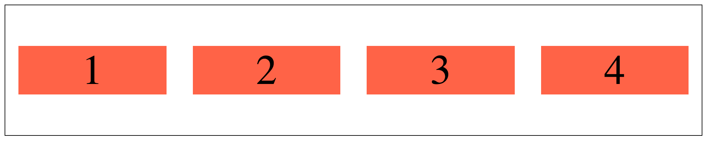
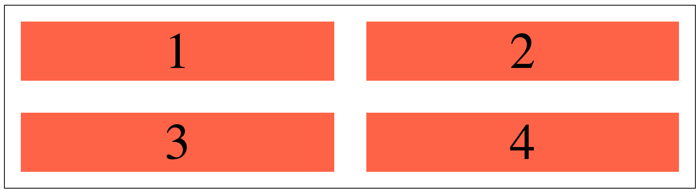
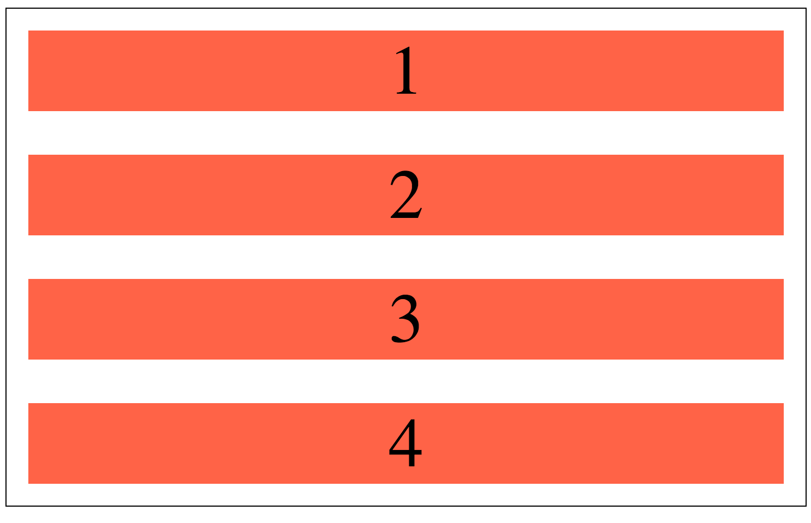

# Flexbox Basics

In this exercise, you'll use `flexbox` to manipulate the position of elements on your page.

First create a new project called "flexbox-basics", and then add an *index.html* and *main.css* file. Add the HTML and CSS so that your page looks like the examples below...

Large screens (>992px):

Medium screens (>768px):

Small screens:

